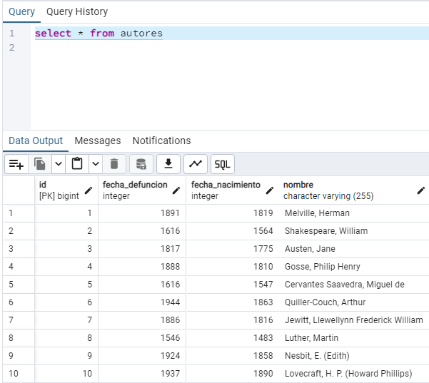

# ALURA_LiterAlura_CHALLENGE_2

El Challenge 2 llamado "LiterAlura" fue hecho con Java y Springboot, este proyecto hace uso de una api ("https://gutendex.com/books/").

Estos datos obtenidos por la API son procesadors y enviados a una base de datos hecha con Postgres SQL, la cual tiene de nombre "literalura", en esta base de datos se encuentran las tablas mapeadas en java, las cuales son, autores y libros.

El funcionamiento es sencillo, se consume la API, los datos obtenidos son procesados en clases y records para posteriormente ser almacenados en la base de datos.

El programa incluye unas funcionalidades específicas para ver cierto contenido o buscar específicamente un libro, ya sea por nombre, o por el idioma.

Empezando por la primera opción, que funciona de la siguiente forma:

La segunda opción se encarga de mostrar los libros que ya fueron almacenados dentro de la base de datos.

La tercera opción se encarga de buscar y mostrar los autores existentes dentro de la base de datos.

La opción número 4 nos permite ingresar un año, y el programa se encargará de buscar entre todos los años de nacimiento y defunción de los autores, si este número está, si es el caso, mostrará a los autores que coinciden con esta petición. Está hecha a base de una Derived Query.

La quinta y última opción, nos permite filtrar los libros por idioma.

En la base de datos se vería así el llamado de libros:

y el llamado de autores registrados en la base de datos, así:

#AluraLATAM #G6
